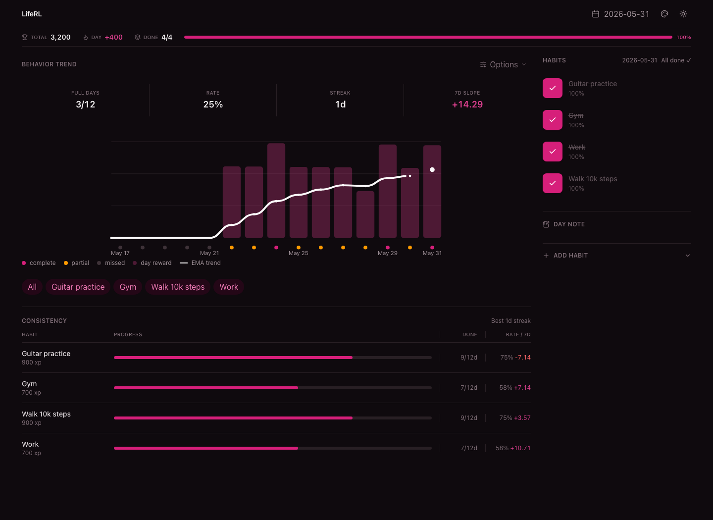
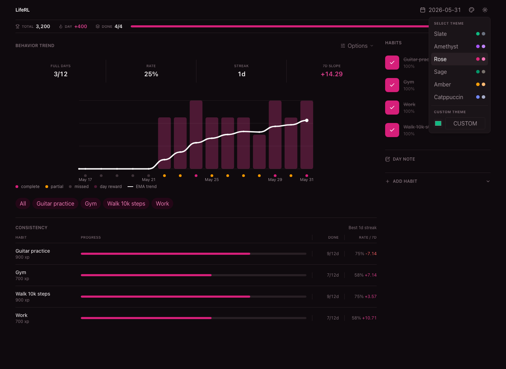
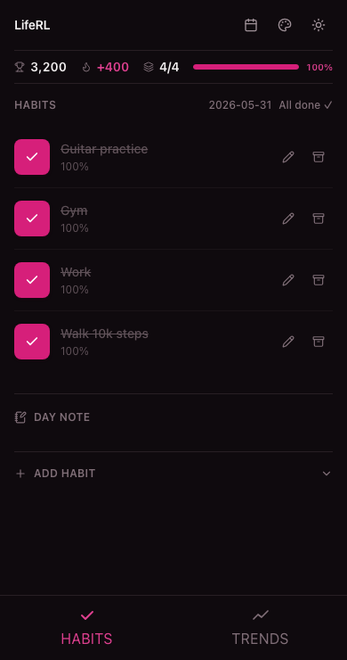
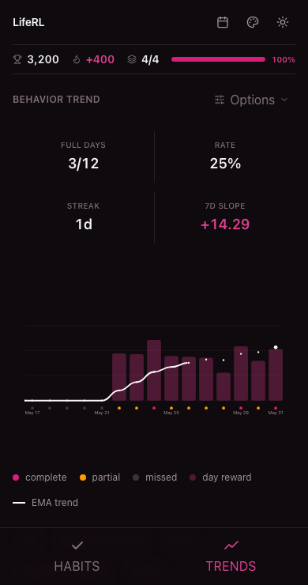

# LifeRL

A markdown-backed vibe habit tracker to fix my life.

LifeRL keeps the source of truth in `liferl.md`, so your habits, notes, scores,
and history stay readable in Obsidian. The web UI is just a faster way to edit
the file and see reward trends.

## Screenshots

Desktop dashboard and theme settings

<p>
  
  
</p>

Mobile habits and trends

<p>
  
  
</p>

## Run

```sh
bun install
bun run dev
```

Open `http://localhost:5173`.

Use a different Markdown file:

```sh
LIFERL_RECORDS_PATH=/path/to/liferl.md bun run dev
```

## Install As PWA

LifeRL is installable as a PWA.

Desktop:

1. Open `http://localhost:5173`.
2. Use the browser install button in the address bar.

Phone:

1. Open the app URL in your mobile browser.
2. Use **Add to Home Screen**.

## Linux Service

```sh
bun run service:setup
bun run service:start
bun run service:status
bun run service:logs
bun run service:stop
```

For systemd user service:

```sh
bun run service:systemd:install
```

## VPS

Prefer running LifeRL on a VPS behind Tailscale instead of exposing it to the
public internet.

On the VPS:

```sh
git clone https://github.com/joey00072/liferl.git
cd liferl
bun install
bun run service setup --records /srv/liferl/liferl.md --host 0.0.0.0 --port 5173 --yes
bun run service:systemd:install
```

Then open it from your own devices with:

```txt
http://<vps-tailscale-name>:5173
```

Keep the VPS firewall closed to the public internet for port `5173`.

## Data

The database is [liferl.md](liferl.md). The parser reads the `<records>` block
using the `liferl.v1` schema.

Useful docs:

- [Schema](docs/schema.md)
- [Implementation notes](docs/todo.md)
- [Docs index](docs/index.md)

## Checks

```sh
bun run typecheck
bun test
bun run build
```

Update README screenshots:

```sh
bun run screenshots
```

## Roadmap

React Native app later. The backend should stay the source of truth so mobile
can sync through stable API routes instead of parsing Markdown directly.

## License

MIT
